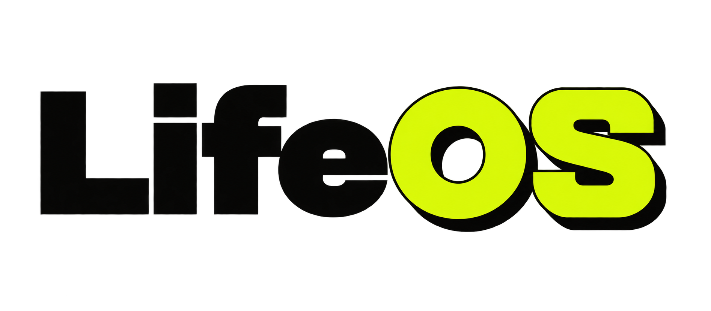

# LifeOS — frontend demo

A static, GitHub Pages-ready preview of the LifeOS dashboard. It demonstrates the interface and interactions with fictional sample content; it is not the private/local LifeOS application.

> ## ✨ [Open the live LifeOS demo →](https://lifeos-3q6.pages.dev/)
>
> Explore the frontend demo at **[lifeos-3q6.pages.dev](https://lifeos-3q6.pages.dev/)**.

## Run or publish

Open `index.html` in a browser, or publish this folder with GitHub Pages (Settings → Pages → deploy from the repository root). No build command, server, account, or environment variables are required.

## What works

- Dashboard, calendar, task, focus, academic, project, goal, and activity views
- Creating, editing, deleting, completing, filtering, and searching demo records
- Theme preference and demo changes saved only in the current browser's local storage
- Offline app shell through the included service worker

## Full LifeOS capabilities

The private, local version of LifeOS extends this interface with a Flask and SQLite backend. It is designed for one person running it on their own computer, with their data kept locally.

- A persistent local database for tasks, events, academic events, projects, goals, messages, notifications, contacts, media, activity, settings, and focus sessions
- API-backed create, read, update, delete, completion, status, search, and dashboard actions
- A Today view that combines tasks, scheduled events, academic deadlines, important messages, notifications, media releases, and a priority-based next-action suggestion
- Calendar day, week, and month views, including local events and academic milestones
- Focus sessions with time tracking, completion activity, and task completion
- Academic calendar support: manual events, pasted or uploaded ICS files, remote ICS URLs, duplicate prevention, and course/deadline metadata
- Google OAuth integration for Calendar and Gmail when the owner supplies their own Google Cloud credentials; tokens are encrypted and stay in the local database
- Gmail synchronization limited to the contacts explicitly enabled by the owner, rather than scanning the entire inbox
- Configurable local startup, backup, reset, PWA support, theme preference, and command palette shortcuts

The full version is intentionally not included here because its backend, local database, configuration, credentials, and personal data do not belong in a public repository.

## Deliberately excluded

This repository must remain public-safe. It does **not** include the Flask backend, SQLite databases and backups, JSON data exports, `.env` files, API routes, OAuth credentials/tokens, Google/Gmail sync, launch/reset scripts, or any personal records. Integration buttons explain that they are disabled in the public demo.

## Project structure

```text
index.html             App shell
static/main.css        Styling
static/app.js          Shared UI behavior
static/enhanced.js     Views and interactions
static/api.js          Browser-only demo data store
```

To reset the demo, clear this site's local storage in your browser.
